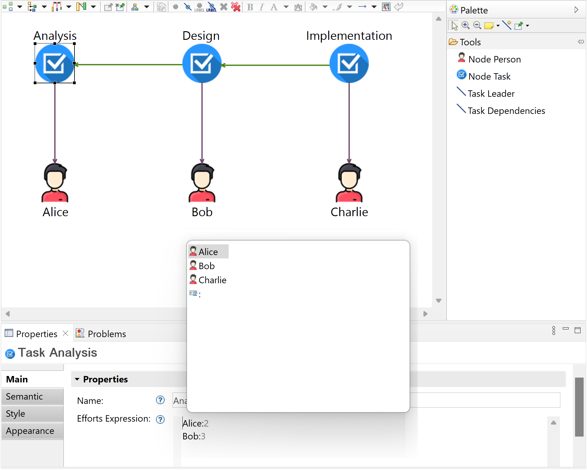

# [Graphite](#contents)

## [Introduction](#contents)
Graphite is a tool for streamlining the development of hybrid graphical-textual Sirius/Xtext-based model editors, by using as little hand-written code as possible.

This repository contains a hybrid graphical-textual DSL for modelling the workloads of projects, i.e., the `Project Workloads DSL`. Note that a hybrid graphical-textual DSL has a hybrid (part-graphical and part-textual) syntax.

When using Graphite, one must first define the abstract syntax, and the graphical and textual syntax(es) of the DSL. 

The EMF projects are related to the abstract syntax, i.e., [workload.emf](https://github.com/epsilonlabs/graphite/tree/main/workload.emf), [workload.emf.edit](https://github.com/epsilonlabs/graphite/tree/main/workload.emf.edit), [workload.emf.editor](https://github.com/epsilonlabs/graphite/tree/main/workload.emf.editor). Additionally, the Sirius project defines the graphical syntax ([workload.sirius_design](https://github.com/epsilonlabs/graphite/tree/main/workload.sirius_design)), whereas the Xtext projects define the textual syntax ([workload.xtext_grammar](https://github.com/epsilonlabs/graphite/tree/main/workload.xtext_grammar); [workload.xtext_grammar.ide](https://github.com/epsilonlabs/graphite/tree/main/workload.xtext_grammar.ide); [workload.xtext_grammar.ui](https://github.com/epsilonlabs/graphite/tree/main/workload.xtext_grammar.ui)).

## [Running the sample](#contents)

To run this sample one must use an Eclipse IDE (ideally [Eclipse Modelling Tools](https://www.eclipse.org/downloads/packages/release/2022-12/r/eclipse-modeling-tools)), that has installed [Eclipse Sirius](https://marketplace.eclipse.org/content/sirius), [Eclipse Xtext](https://marketplace.eclipse.org/content/eclipse-xtext), [EcoreTools](https://marketplace.eclipse.org/content/ecoretools-ecore-diagram-editor), [Epsilon](https://marketplace.eclipse.org/content/epsilon), and [Eclipse Emfatic](https://www.eclipse.org/emfatic).

To run the sample, one must import into a workspace all projects from this repository, except [workload.runtime](https://github.com/epsilonlabs/graphite/tree/main/workload.runtime). 

Once the projects are loaded, errors related to circular dependencies will be reported in the Problems View. To remove the errors from the Problems View, go to `Windows -> Preferences -> Java -> Compiler -> Building -> Build path problems -> Circular dependencies -> set to Warning`. Additionally, right-click on the metamodel ([workload.ecore](https://github.com/epsilonlabs/graphite/tree/main/workload.emf/model/workload.ecore)) and select `Register EPackages`. Then, right-click on the errors from the Problems View and select `Delete`. Additionally, clean the workspace by selecting `Project -> Clean -> Clean all projects`.

Create a Run Configuration of type `Eclipse Application`, and set the property `Run a product` to `org.eclipse.epp.package.modeling.product`. Run the configuration and in the new Eclipse instance, import the project [workload.runtime](https://github.com/epsilonlabs/graphite/tree/main/workload.runtime). Open [representations.aird](https://github.com/epsilonlabs/graphite/blob/main/workload.runtime/representations.aird) and then open the diagram called `new Project diagram`. When selecting a model element of type `Task` in the diagram, notice that in the Properties View, in the `Main` tab, the textual editor for the property `Efforts Expression` is an Xtext editor with developer assistance features, such as syntax highlighting, auto-completion, and error detection, as displayed in the following figure.



## [Steps for using Graphite](#contents)

In the following, the required steps for using Graphite are described.

1. Define the metamodel of the DSL, by creating an Ecore Modeling Project. For the `Project Workloads DSL`, the metamodel ([workload.emf](https://github.com/epsilonlabs/graphite/tree/main/workload.emf/model/workload.emf)) has been defined using [Eclipse Emfatic](https://www.eclipse.org/emfatic). For each property from the metamodel that one would like to express with a textual syntax, a new textual property must be added in the metamodel. Additionally, an annotation must be added to the metamodel, to define the mapping between the added textual property and the underlying model element. The textual property `attr String effortsExpression` has been defined, to store the textual representation of `val Effort[*] efforts`. 

    The annotation `@syntax(grammar="workload.xtext_grammar.Efforts", derive="efforts")` specifies that the property `effortsExpression` is parsed according to the grammar `workload.xtext_grammar.Efforts` and the resulting model elements are assigned to the `efforts` property. After defining the metamodel with [Eclipse Emfatic](https://www.eclipse.org/emfatic), one must right-click on the file and select `Generate Ecore Model.`

2. In the Generator Model ([workload.genmodel](https://github.com/epsilonlabs/graphite/tree/main/workload.emf/model/workload.genmodel)), the property named `Root Extends Class` must be set to `graphite.shared.CustomEObjectImpl`. In the [MANIFEST.MF](https://github.com/epsilonlabs/graphite/tree/main/workload.emf/META-INF/MANIFEST.MF) of the EMF project ([workload.emf](https://github.com/epsilonlabs/graphite/tree/main/workload.emf)), add Graphite as a dependency. Then, `Generate All` code using the Generator Model.

3. Define the textual syntax by creating an Xtext grammar ([workload.xtext_grammar](https://github.com/epsilonlabs/graphite/tree/main/workload.xtext_grammar)). The grammar must import the metamodel to specify which parts of the abstract syntax are expressed with a textual syntax. Once the grammar is defined ([Efforts.xtext](https://github.com/epsilonlabs/graphite/blob/main/workload.xtext_grammar/src/workload/xtext_grammar/Efforts.xtext)), right-click inside the editor of the grammar and select `Run As -> Generate Xtext Artifacts`. In the main project of the grammar ([workload.xtext_grammar](https://github.com/epsilonlabs/graphite/tree/main/workload.xtext_grammar)), add Graphite as a dependency in [MANIFEST.MF](https://github.com/epsilonlabs/graphite/blob/main/workload.xtext_grammar/META-INF/MANIFEST.MF). Additionally, add `org.eclipse.ui`, `org.eclipse.xtext`, [workload.xtext_grammar](https://github.com/epsilonlabs/graphite/tree/main/workload.xtext_grammar) and [workload.xtext_grammar.ui](https://github.com/epsilonlabs/graphite/tree/main/workload.xtext_grammar.ui) as dependencies in the [MANIFEST.MF](https://github.com/epsilonlabs/graphite/tree/main/workload.emf/META-INF/MANIFEST.MF) of the main EMF project ([workload.emf](https://github.com/epsilonlabs/graphite/tree/main/workload.emf)).

4. To define the graphical syntax, one must create a Sirius Viewpoint Specification Project ([workload.sirius_design](https://github.com/epsilonlabs/graphite/tree/main/workload.sirius_design)), in which Graphite must be added as a dependency in [MANIFEST.MF](https://github.com/epsilonlabs/graphite/blob/main/workload.sirius_design/META-INF/MANIFEST.MF). In the Viewpoint Specification Model (VSM), i.e., [workload.odesign](https://github.com/epsilonlabs/graphite/blob/main/workload.sirius_design/description/workload.odesign), define the graphical syntax for the metamodel. Then, in [workload.odesign](https://github.com/epsilonlabs/graphite/blob/main/workload.sirius_design/description/workload.odesign), select `Viewpoint Specification Editor -> Load Resource -> Browse Workspace -> graphite/src/graphite/artefacts/graphite_properties.odesign`. Expand the imported odesign file and copy the properties group called `Graphite Properties` into the `workload` root directory of [workload.odesign](https://github.com/epsilonlabs/graphite/blob/main/workload.sirius_design/description/workload.odesign). Modify the class [Services.java](https://github.com/epsilonlabs/graphite/blob/main/workload.sirius_design/src/workload/sirius_design/Services.java), to extend it with the [SiriusServices](https://github.com/epsilonlabs/graphite/blob/main/graphite/src/graphite/graphical/SiriusServices.java) class from Graphite.

5. Graphite contains a model-to-text (M2T) transformation that takes as input the annotated metamodel and generates glue code that delegates API calls to Graphite. The file [graphite/src/graphite/modelmanagement/main.egx](https://github.com/epsilonlabs/graphite/blob/main/graphite/src/graphite/modelmanagement/main.egx) contains the M2T transformation, that is implemented using The Epsilon Generation Language ([EGL](https://www.eclipse.org/epsilon/doc/egl)). One must first customise the transformation, to include information about the main EMF project name (`workload.emf`), the directory in which the EMF code has been generated by the Generator Model (`src` or `src-gen`) and the directory in which the glue code will be generated. To specify this data, the values of the following variables must be modified: `projectName`, `directoryEmfCodeGeneration` `directoryGraphiteCodeGeneration`. For running the Graphite M2T transformation, one must create a Run Configuration of type `EGL Generator`. In the `Template` tab, the `Source` must be set to [/graphite/src/graphite/modelmanagement/main.egx](https://github.com/epsilonlabs/graphite/blob/main/graphite/src/graphite/modelmanagement/main.egx). In the `Models` tab, add [workload.ecore](https://github.com/epsilonlabs/graphite/blob/main/workload.emf/model/workload.ecore) as a new EMF Model. Finally, run the transformation. The following output must be displayed after running the transformation:

```
Successfully wrote to ../../../../workload.emf/src-gen/workload/impl/XtextTaskImpl.java
Successfully wrote to ../../../../workload.emf/src-gen/workload/impl/PropertiesData.java
Successfully wrote to ../../../../workload.emf/src-gen/workload/impl/XtextWorkloadFactoryImpl.java
Successfully wrote to ../../../../workload.emf/src-gen/workload/impl/WorkloadEditorStartup.java
Successfully patched ../../../../workload.emf/src/workload/WorkloadFactory.java
Successfully patched ../../../../workload.xtext_grammar/src/workload/xtext_grammar/EffortsRuntimeModule.java
```

6. In the main EMF project (`workload.emf`), in [MANIFEST.MF](https://github.com/epsilonlabs/graphite/tree/main/workload.emf/META-INF/MANIFEST.MF), in the `Extensions` tab, add a new extension point called `org.eclipse.emf.ecore.extension_parser`, and specify the type (`workload`) and set the class to [graphite.textual.XtextXMIResourceFactoryImpl](https://github.com/epsilonlabs/graphite/blob/main/graphite/src/graphite/textual/XtextXMIResourceFactoryImpl.java).

7. In the editor EMF project (`workload.emf.editor`), in [MANIFEST.MF](https://github.com/epsilonlabs/graphite/tree/main/workload.emf.editor/META-INF/MANIFEST.MF), in the `Extensions` tab, add a new extension point called `org.eclipse.ui.startup` and set the class to [workload.impl.WorkloadEditorStartup](https://github.com/epsilonlabs/graphite/blob/main/workload.emf/src-gen/workload/impl/WorkloadEditorStartup.java). The class `WorkloadEditorStartup` has been generated by the Graphite M2T transformation. For a different DSL, a class with a different name would have been generated, with the naming convention `{packageName}EditorStartup`.

8. Finally, Graphite must be configured to be used with the `Project Workloads DSL`. In [graphite/plugin.properties](https://github.com/epsilonlabs/graphite/blob/main/graphite/plugin.properties), the `editorId` and the `fileExtensions` of the DSL must be configured. The `editorId` of the DSL can be found in the editor EMF project (`workload.emf.editor`), in [plugin.xml](https://github.com/epsilonlabs/graphite/blob/main/workload.emf.editor/plugin.xml). Currently, Graphite can be used with only one hybrid graphical-textual DSL in one workspace. If one would like to use Graphite with another DSL, Graphite would have to be imported and used in another workspace containing the other DSL. Note that Graphite will be upgraded in the future to remove the necessity of this step, and to enable multiple hybrid graphical-textual DSLs in the same workspace.