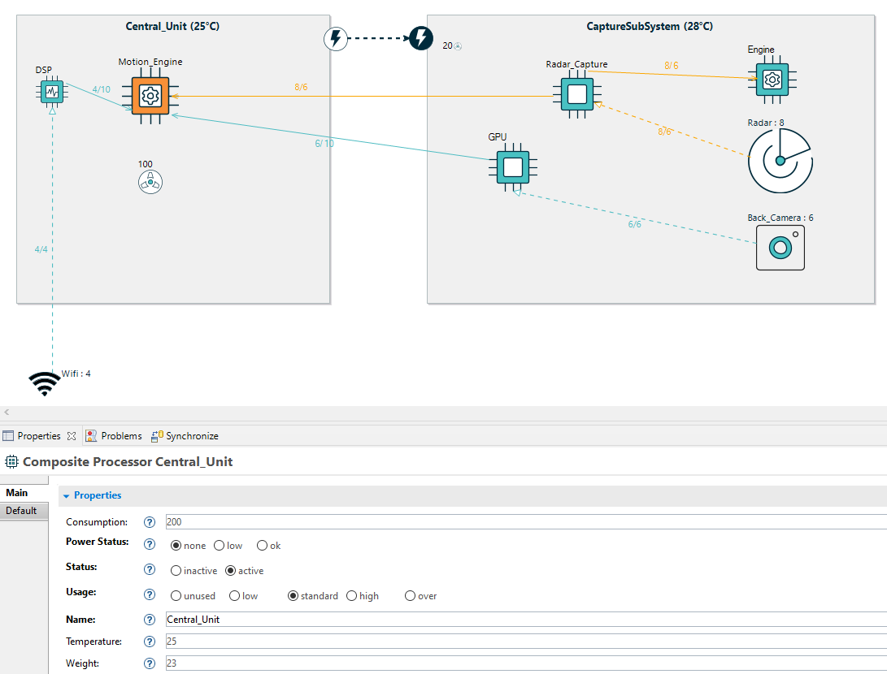
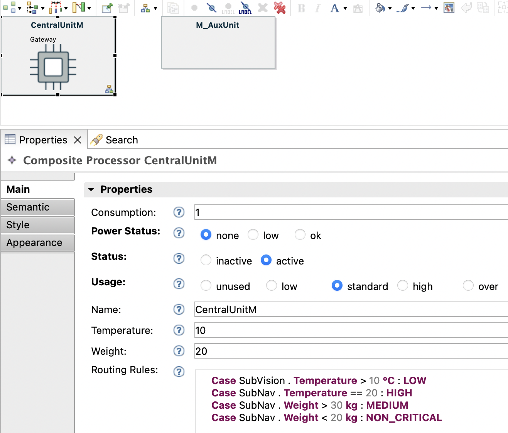

## Flow Designer DSL

The Flow Designer DSL supports the modelling of data processing systems in which components exchange information through structured data flows. The language provides a set of modeling constructs such as *System*, *Processor*, *CompositeProcessor*, *DataSource*, and *DataFlow*, which together represent the main structural elements of a processing topology. These constructs allow users to define system components, organise them hierarchically, and specify how data moves between them within the modeled architecture. In addition to the graphical representation of structure, the language also incorporates a textual syntax used to define routing rules, which express conditions and decision logic that control how data is processed or routed within the system.  

 

